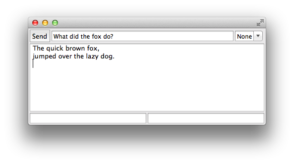
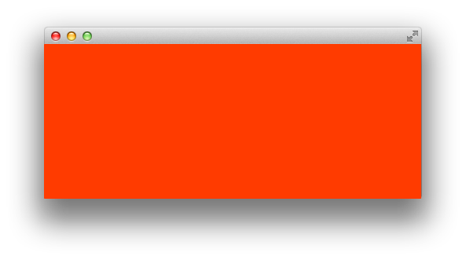
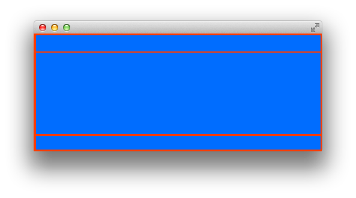
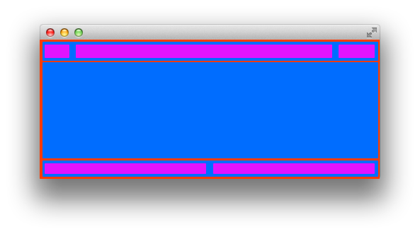

StripLayout
===========

The following layout is difficult to achieve with the standard SWT layout classes.

The `StripLayout` class lays out controls in strips which have optional fill 
and margin characteristics.

We can break down this layout by looking at each part, from the top down.

		Display display = new Display();
		Shell shell = new Shell(display);
		shell.setLayout(new StripLayout(false));

We make the shell, then assign a `StripLayout` with `isHorizontal` set to `false`. This
is going to layout its children vertically. 

Now we can make each of the child rows.

		// Row 1
		Composite sendRow = new Composite(shell, SWT.NO_TRIM);
		sendRow.setLayout(new StripLayout(true));
		sendRow.setLayoutData(new StripData(true, false, new Margin(3, 3, 3, 0)));
		
		// Row 2
		Text outputText = new Text(shell, SWT.MULTI | SWT.BORDER);
		outputText.setLayoutData(new StripData(true, true, new Margin(3, 3, 3, 3)));
		
		// Row 3
		Composite statusRow = new Composite(shell, SWT.NO_TRIM);
		statusRow.setLayout(new StripLayout(true));
		statusRow.setLayoutData(new StripData(true, false, new Margin(3, 0, 3, 3)));

The first row is a `Composite` as we want it to contain a number of child controls. 
It should have a fixed height, and fill in the horizontal direction,
so the `StripData` gets `true` for `fillHorizontal` and `false` for `fillVertical`.
The first row gets a margin of 3 on the left, top, and bottom, to create space between
the shell and itself.

The second row should fill the remaining area, to we set both fills to `true`. It
has a margin on all sides to distance itself from the shell to the left and right,
and the controls above and below.

The third row is like the first, with margin on the left, right, and bottom, to provide
a gap between the shell and itself.

This gives us the following.

Finally we can create the top row and the last.

		// Row 1
		Button sendButton = new Button(sendRow, SWT.DEFAULT);
		sendButton.setLayoutData(new StripData(false, false));
		sendButton.setText("Send");
		
		Text sendText = new Text(sendRow, SWT.SINGLE | SWT.BORDER);
		sendText.setLayoutData(new StripData(true, false, new Margin(3, 0, 3, 0)));
		
		Combo lineEnding = new Combo(sendRow, SWT.SIMPLE);
		lineEnding.setItems(new String[] {"None", "Cr", "Lr", "CrLf"});
		lineEnding.select(0);

		// Row 3
		Text leftStatus = new Text(statusRow, SWT.BORDER);
		leftStatus.setLayoutData(new StripData(true,false, new Margin(0, 0, 2, 0)));
		
		Text rightStatus = new Text(statusRow, SWT.BORDER);
		rightStatus.setLayoutData(new StripData(true,false, new Margin(1, 0, 0, 0)));

The parent for the controls on row 1 is the `sendRow`. The button should not fill, the
"send text" should stretch in the horizontal direction,
and the combo box should not fill. The send text gets some margin on the left and right so
it doesn't sit against its neighbours.

On row 3 both controls should be fixed in the vertial direction but fill horizontally. The
left control has some right margin, and the right control has some left margin to keep them
apart.

This gives us the following.

The full program code is given below.

	public static void main(String[] args) {
		Display display = new Display();
		Shell shell = new Shell(display);
		shell.setLayout(new StripLayout(false));
		
		Composite sendRow = new Composite(shell, SWT.NO_TRIM);
		sendRow.setLayout(new StripLayout(true));
		sendRow.setLayoutData(new StripData(true, false, new Margin(3, 3, 3, 0)));
		
		Button sendButton = new Button(sendRow, SWT.DEFAULT);
		sendButton.setLayoutData(new StripData(false, false));
		sendButton.setText("Send");
		
		Text sendText = new Text(sendRow, SWT.SINGLE | SWT.BORDER);
		sendText.setLayoutData(new StripData(true, false, new Margin(3, 0, 3, 0)));
		
		Combo lineEnding = new Combo(sendRow, SWT.SIMPLE);
		lineEnding.setItems(new String[] {"None", "Cr", "Lr", "CrLf"});
		lineEnding.select(0);
		
		Text outputText = new Text(shell, SWT.MULTI | SWT.BORDER);
		outputText.setLayoutData(new StripData(true, true, new Margin(3, 3, 3, 3)));
		
		Composite statusRow = new Composite(shell, SWT.NO_TRIM);
		statusRow.setLayout(new StripLayout(true));
		statusRow.setLayoutData(new StripData(true, false, new Margin(3, 0, 3, 3)));

		Text leftStatus = new Text(statusRow, SWT.BORDER);
		leftStatus.setLayoutData(new StripData(true,false, new Margin(0, 0, 2, 0)));
		
		Text rightStatus = new Text(statusRow, SWT.BORDER);
		rightStatus.setLayoutData(new StripData(true,false, new Margin(1, 0, 0, 0)));
		
		shell.open();
		while (!shell.isDisposed()) {
			if (!display.readAndDispatch()) {
				display.sleep();
			}
		}
		display.dispose();
	}

Rob