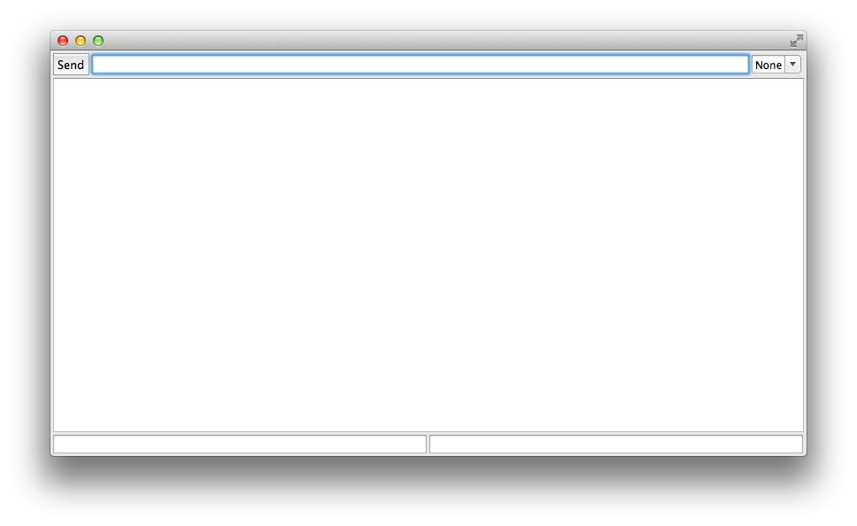

StripLayout
===========

The following layout is difficult to achieve with the standard SWT layout classes.

The `StripLayout` class lays out controls in strips which have optional fill characteristics.

The next image annotates the process.

The outer strip (coloured purple) is a vertical strip with three controls. The
top row fills horizontally. The second (output text) fills both
horizontally and vertically. The last row fills horizontally.

Within the first row three controls are managed by s strip layout. This is set to
horizontal. The first control (the send button) and the last control (the combo)
have no fill, while the center has horizontal fill.

The bottom row has two controls which both fill horizontally.

The following program reproduces the screenshot above.

	public static void main(String[] args) {
		Display display = new Display();
		Shell shell = new Shell(display);
		shell.setLayout(new StripLayout(false, new Margin(3)));
		
		Composite sendRow = new Composite(shell, SWT.NO_TRIM);
		sendRow.setLayout(new StripLayout(true, new Margin(0, 0, 0, 3)));
		sendRow.setLayoutData(new StripData(true, false));
		
		Button sendButton = new Button(sendRow, SWT.DEFAULT);
		sendButton.setLayoutData(new StripData(false, false));
		sendButton.setText("Send");
		
		Text sendText = new Text(sendRow, SWT.SINGLE | SWT.BORDER);
		sendText.setLayoutData(new StripData(true, false, new Margin(3, 0, 3, 0)));
		
		Combo lineEnding = new Combo(sendRow, SWT.SIMPLE);
		lineEnding.setItems(new String[] {"None", "Cr", "Lr", "CrLf"});
		lineEnding.select(0);
		
		Text outputText = new Text(shell, SWT.MULTI | SWT.BORDER);
		outputText.setLayoutData(new StripData(true, true));
		
		Composite statusRow = new Composite(shell, SWT.NO_TRIM);
		statusRow.setLayout(new StripLayout(true, new Margin(0, 3, 0, 3)));
		statusRow.setLayoutData(new StripData(true, false));

		Text leftStatus = new Text(statusRow, SWT.BORDER);
		leftStatus.setLayoutData(new StripData(true,false, new Margin(0, 0, 2, 0)));
		
		Text rightStatus = new Text(statusRow, SWT.BORDER);
		rightStatus.setLayoutData(new StripData(true,false, new Margin(1, 0, 0, 0)));
		
		shell.open();
		while (!shell.isDisposed()) {
			if (!display.readAndDispatch()) {
				display.sleep();
			}
		}
		display.dispose();
	}

A feature that can be seen in the above code that has not yet been explained is "margin".
The layout data for each control may have a left, top, right, and bottom margin which will
be applied when laying out the control.
